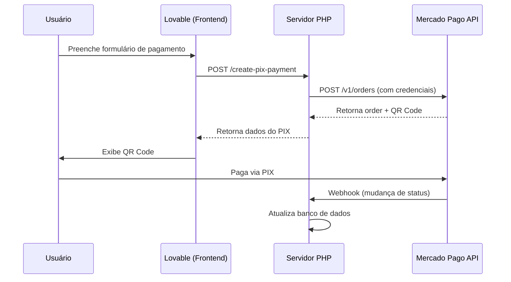

# Integração Mercado Pago - Servidor Externo PHP

Esta integração permite gerar pagamentos PIX através do Mercado Pago sem armazenar credenciais no Lovable.

## 📁 Estrutura de Arquivos

```
api/
├── config/
│   └── mercadopago.php          # Configurações e credenciais (CRIAR)
├── routes/
│   └── mercadopago.php          # Rotas da API (CRIAR)
└── examples/
    ├── mercadopago_config_example.php
    ├── mercadopago_endpoints.php
    └── mercadopago_README.md
```

## 🚀 Configuração

### 1. Criar arquivo de configuração

Copie o arquivo `api/examples/mercadopago_config_example.php` para `api/config/mercadopago.php`:

```bash
cp api/examples/mercadopago_config_example.php api/config/mercadopago.php
```

### 2. Adicionar credenciais do Mercado Pago

Edite o arquivo `api/config/mercadopago.php` e adicione suas credenciais:

```php
define('MERCADOPAGO_ACCESS_TOKEN', 'SEU_ACCESS_TOKEN_AQUI');
```

**Onde obter as credenciais:**
1. Acesse: https://www.mercadopago.com.br/developers/panel/app
2. Crie ou selecione uma aplicação
3. Vá em "Credenciais"
4. Use credenciais de teste (TEST-...) para desenvolvimento
5. Use credenciais de produção (APP_USR-...) para produção

### 3. Criar endpoints da API

Copie o código de `api/examples/mercadopago_endpoints.php` e integre nas suas rotas existentes, ou crie um novo arquivo `api/routes/mercadopago.php`.

### 4. Adicionar ao .gitignore

**IMPORTANTE:** Adicione o arquivo de configuração ao `.gitignore`:

```
api/config/mercadopago.php
```

## 🔌 Endpoints Disponíveis

### 1. Testar Credenciais
```
GET /api/mercadopago/test-credentials
```

Verifica se as credenciais do Mercado Pago estão válidas.

**Resposta de sucesso:**
```json
{
  "success": true,
  "data": {
    "environment": "sandbox",
    "status": "connected"
  },
  "message": "Credenciais válidas"
}
```

### 2. Obter Tipos de Documento
```
GET /api/mercadopago/document-types
```

Retorna os tipos de documento aceitos (CPF, CNPJ, etc).

**Resposta de sucesso:**
```json
{
  "success": true,
  "data": [
    {
      "id": "CPF",
      "name": "CPF",
      "type": "number",
      "min_length": 11,
      "max_length": 11
    },
    {
      "id": "CNPJ",
      "name": "CNPJ",
      "type": "number",
      "min_length": 14,
      "max_length": 14
    }
  ]
}
```

### 3. Criar Pagamento PIX
```
POST /api/mercadopago/create-pix-payment
Content-Type: application/json

{
  "payerFirstName": "João",
  "payerLastName": "Silva",
  "email": "teste@email.com",
  "identificationType": "CPF",
  "identificationNumber": "12345678900",
  "transactionAmount": "100.00",
  "description": "Teste de pagamento"
}
```

**Resposta de sucesso:**
```json
{
  "success": true,
  "data": {
    "order_id": "ORD01HRYFWNYRE1MR1E60MW3X0T2P",
    "status": "action_required",
    "payment_id": "PAY01HRYFXQ53Q3JPEC48MYWMR0TE",
    "qr_code": "00020126580014br.gov.bcb.pix0136b76aa9c2...",
    "qr_code_base64": "iVBORw0KGgoAAAANSUhEUgAABWQAAAVk...",
    "ticket_url": "https://www.mercadopago.com.br/..."
  },
  "message": "Pagamento PIX criado com sucesso"
}
```

## 🔐 Segurança

- ✅ Credenciais armazenadas apenas no servidor externo
- ✅ Nenhuma chave sensível no Lovable
- ✅ Comunicação via HTTPS
- ✅ Validação de dados no servidor
- ✅ CORS configurado adequadamente

## 🧪 Testando a Integração

### No Lovable:

1. Faça login como administrador
2. Acesse: **Integrações > Mercado Pago**
3. Clique em "Testar Credenciais"
4. Preencha o formulário de teste
5. Clique em "Gerar Pagamento PIX"

### Credenciais de Teste do Mercado Pago:

Use usuários de teste para simular pagamentos:
- Acesse: https://www.mercadopago.com.br/developers/pt/docs/checkout-api/additional-content/your-integrations/test-accounts
- Crie usuários de teste
- Use as credenciais geradas

## 📝 Webhook (Opcional)

Para receber notificações de mudança de status:

```php
// api/routes/mercadopago_webhook.php
if ($method === 'POST' && strpos($path, '/mercadopago/webhook') !== false) {
    $data = json_decode(file_get_contents('php://input'), true);
    
    // Processar notificação
    if ($data['type'] === 'payment') {
        $paymentId = $data['data']['id'];
        
        // Buscar detalhes do pagamento
        // Atualizar status no banco de dados
        // Creditar saldo ao usuário, etc.
    }
    
    http_response_code(200);
    exit;
}
```

Configure a URL do webhook no painel do Mercado Pago:
1. Acesse sua aplicação
2. Vá em "Webhooks"
3. Adicione: `https://seu-dominio.com/api/mercadopago/webhook`

## 🔄 Fluxo de Pagamento



## ❓ Troubleshooting

### Erro: "Credenciais não configuradas"
- Verifique se o arquivo `api/config/mercadopago.php` existe
- Confirme se as constantes estão definidas corretamente

### Erro: "Credenciais inválidas"
- Verifique se o Access Token está correto
- Certifique-se de usar credenciais de teste em sandbox
- Confirme se o token não expirou

### QR Code não aparece
- Verifique a resposta da API no console do navegador
- Confirme se o campo `qr_code_base64` está presente na resposta
- Teste o endpoint diretamente com Postman/Insomnia

## 📚 Referências

- [Documentação Mercado Pago - PIX](https://www.mercadopago.com.br/developers/pt/docs/checkout-api-v2/payment-integration/pix)
- [Criar aplicação](https://www.mercadopago.com.br/developers/panel/app)
- [Contas de teste](https://www.mercadopago.com.br/developers/pt/docs/checkout-api/additional-content/your-integrations/test-accounts)

## 🎯 Próximos Passos

- [ ] Implementar webhook para atualização automática de status
- [ ] Adicionar página de confirmação de pagamento
- [ ] Integrar com sistema de carteira/saldo
- [ ] Adicionar logs de transações
- [ ] Implementar testes automatizados
