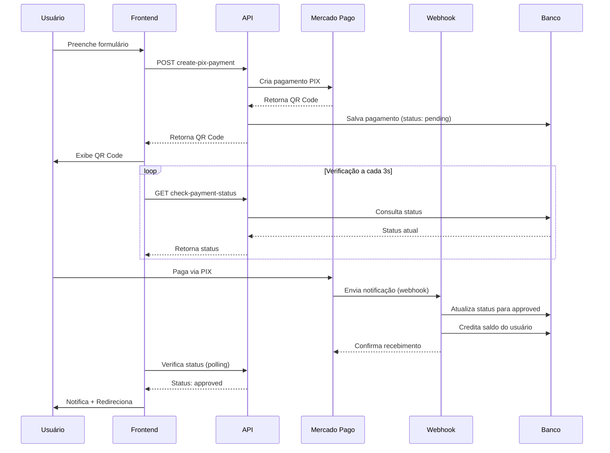

# Integração Mercado Pago - Documentação

## 📋 Visão Geral

Esta integração permite criar e gerenciar pagamentos PIX através da API do Mercado Pago. O sistema inclui:

- Geração de pagamentos PIX com QR Code
- Verificação automática de status
- Webhook para notificações do Mercado Pago
- Histórico completo de pagamentos
- Creditamento automático após aprovação

## 🚀 Endpoints Disponíveis

### 1. Criar Pagamento PIX
**Endpoint:** `POST /mercadopago/create-pix-payment.php`

**Request Body:**
```json
{
  "user_id": 123,
  "email": "USUARIO@EMAIL.COM",
  "payerFirstName": "JOÃO",
  "payerLastName": "SILVA",
  "identificationType": "CPF",
  "identificationNumber": "12345678900",
  "transactionAmount": "100.00",
  "description": "RECARGA DE SALDO"
}
```

**Response:**
```json
{
  "success": true,
  "data": {
    "payment_id": "123456789",
    "qr_code": "00020126...",
    "qr_code_base64": "iVBORw0KGgo...",
    "status": "pending"
  }
}
```

### 2. Verificar Status do Pagamento
**Endpoint:** `GET /mercadopago/check-payment-status.php?payment_id=123456789`

**Response:**
```json
{
  "success": true,
  "data": {
    "payment_id": "123456789",
    "status": "approved",
    "amount": 100.00,
    "created_at": "2025-10-09 12:00:00"
  }
}
```

### 3. Listar Pagamentos do Usuário
**Endpoint:** `GET /mercadopago/list-payments.php?user_id=123&page=1&limit=20`

**Response:**
```json
{
  "success": true,
  "data": [
    {
      "id": 1,
      "payment_id": "123456789",
      "amount": 100.00,
      "status": "approved",
      "payer_email": "usuario@email.com",
      "created_at": "2025-10-09 12:00:00"
    }
  ],
  "pagination": {
    "total": 1,
    "page": 1,
    "limit": 20,
    "total_pages": 1
  }
}
```

### 4. Webhook do Mercado Pago
**Endpoint:** `POST /mercadopago/webhook.php` (configurar no painel do Mercado Pago)

Este endpoint recebe notificações automáticas do Mercado Pago quando o status do pagamento muda.

**URL do Webhook:**
```
https://api.artepuradesign.com.br/mercadopago/webhook.php
```

## ⚙️ Configuração

### 1. Credenciais do Mercado Pago

Edite o arquivo `api/config/mercadopago.php`:

```php
return [
    'access_token' => getenv('MERCADOPAGO_ACCESS_TOKEN') ?: 'SEU_ACCESS_TOKEN',
    'public_key' => getenv('MERCADOPAGO_PUBLIC_KEY') ?: 'SEU_PUBLIC_KEY',
    'production' => true, // true para produção, false para sandbox
];
```

### 2. Configurar Webhook no Mercado Pago

1. Acesse: https://www.mercadopago.com.br/developers/panel/app
2. Selecione sua aplicação
3. Vá em "Webhooks"
4. Configure a URL: `https://api.artepuradesign.com.br/mercadopago/webhook.php`
5. Selecione os eventos: `payment`

### 3. Banco de Dados

Execute a migração para criar/atualizar a tabela `basepg_pix`:

```bash
cd api/database/migrations
# Execute o SQL no seu banco de dados
```

Ver instruções completas em: `api/database/MIGRATION_INSTRUCTIONS.md`

## 🔄 Fluxo de Pagamento



## 🎯 Verificação Automática de Pagamento

O sistema possui **duas formas** de detectar quando um pagamento é aprovado:

### 1. Polling (Frontend)
- Verifica o status a cada **3 segundos**
- Continua até o pagamento ser aprovado
- Quando aprovado:
  - Exibe notificação de sucesso
  - Redireciona para `/dashboard` após 2 segundos

### 2. Webhook (Backend)
- Mercado Pago notifica instantaneamente
- Atualiza status no banco
- Credita saldo automaticamente
- Mais confiável que polling

**Recomendação:** Configure AMBOS para máxima confiabilidade.

## 📊 Tabela basepg_pix

Estrutura da tabela de pagamentos:

| Campo | Tipo | Descrição |
|-------|------|-----------|
| id | INT | ID único do registro |
| user_id | INT | ID do usuário |
| payment_id | VARCHAR | ID do pagamento no Mercado Pago |
| amount | DECIMAL | Valor do pagamento |
| description | TEXT | Descrição |
| qr_code | TEXT | Código PIX copia e cola |
| qr_code_base64 | LONGTEXT | Imagem QR Code em base64 |
| transaction_id | VARCHAR | ID da transação PIX |
| status | VARCHAR | pending, approved, rejected, etc |
| payer_email | VARCHAR | Email do pagador |
| expires_at | DATETIME | Data de expiração |
| created_at | TIMESTAMP | Data de criação |
| approved_at | TIMESTAMP | Data de aprovação |

## 🐛 Troubleshooting

### Pagamento não está sendo detectado automaticamente

1. **Verifique os logs do webhook:**
   ```bash
   tail -f /var/log/apache2/error.log
   # ou
   tail -f /var/log/nginx/error.log
   ```

2. **Teste o webhook manualmente:**
   ```bash
   curl -X POST https://api.artepuradesign.com.br/mercadopago/webhook.php \
     -H "Content-Type: application/json" \
     -d '{"type":"payment","data":{"id":"123456789"}}'
   ```

3. **Verifique se o webhook está configurado no Mercado Pago:**
   - Acesse o painel de desenvolvedor
   - Veja se há webhooks registrados
   - Verifique se há erros de entrega

### Histórico não exibe pagamentos

1. **Verifique se a migração foi executada:**
   ```sql
   SHOW COLUMNS FROM basepg_pix;
   ```

2. **Verifique se há dados na tabela:**
   ```sql
   SELECT * FROM basepg_pix ORDER BY created_at DESC LIMIT 10;
   ```

3. **Verifique os logs da API:**
   ```bash
   tail -f api/logs/error.log
   ```

### QR Code não é gerado

1. **Teste as credenciais:**
   ```bash
   curl https://api.artepuradesign.com.br/mercadopago/test-credentials.php
   ```

2. **Verifique se o access_token está correto**
3. **Verifique se está em modo produção ou sandbox**

## 📝 Logs e Debug

Para ativar logs detalhados, adicione em `config/mercadopago.php`:

```php
return [
    'debug' => true,
    'log_file' => __DIR__ . '/../logs/mercadopago.log',
    // ...
];
```

## 🔒 Segurança

- ✅ Use HTTPS para todos os endpoints
- ✅ Armazene credenciais em variáveis de ambiente
- ✅ Valide o user_id nas requisições
- ✅ Implemente rate limiting
- ✅ Valide assinatura do webhook (recomendado)

## 📚 Documentação Adicional

- [Mercado Pago - PIX](https://www.mercadopago.com.br/developers/pt/docs/checkout-api/integration-configuration/pix)
- [Mercado Pago - Webhooks](https://www.mercadopago.com.br/developers/pt/docs/your-integrations/notifications/webhooks)
- [Mercado Pago - Status de Pagamento](https://www.mercadopago.com.br/developers/pt/docs/checkout-api/payment-management/payment-status)

## 🆘 Suporte

Para problemas ou dúvidas:
1. Verifique os logs de erro
2. Consulte a documentação oficial do Mercado Pago
3. Teste os endpoints individualmente
4. Verifique a configuração do webhook
